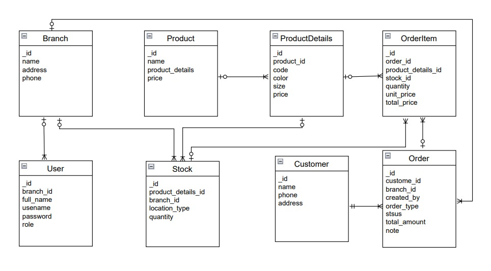
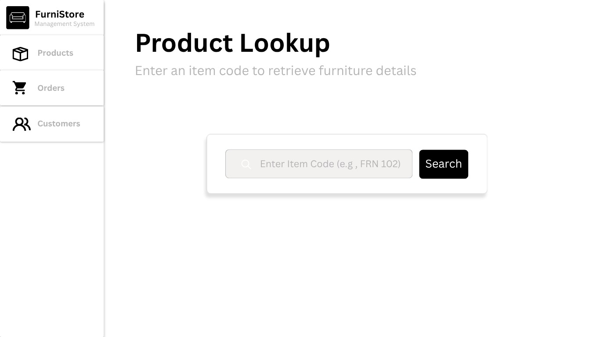
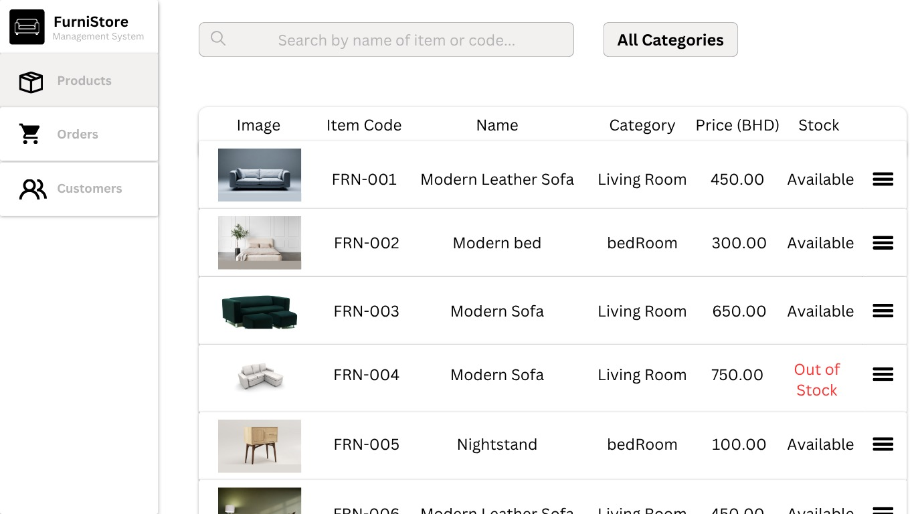

# Furniture Store Management System
## Date: 5/6/2026
### By: Maryam Altammam - Fatema Alnajjas - Zainab Aljad
#### [Maryam's GitHub](https://github.com/imryms) | [Fatema's GitHub](https://github.com/Fatii78) | [Zainab's GitHub](https://github.com/Zaljad)
#### [Maryam's LinkedIn](https://www.linkedin.com/in/maryam-altammam/) | [Fatema's LinkedIn](https://www.linkedin.com/in/fatema-alnajjas/) | [Zainabs's LinkedIn](https://www.linkedin.com/in/zainabaljad/)
***
### ***Description***
#### A web-based Furniture Store Sales System built with Django and PostgreSQL. The system simulates the real workflow inside a furniture showroom — allowing salespersons to search for products, check availability across branches, and process customer orders. If a product is available in the current branch, the customer can pick it up immediately or the system creates a delivery order instead.
***
### ***Technologies Used***
* Python
* Django
* PostgreSQL
* HTML / CSS
***
### ***Getting Started***

##### 1. Log in using your salesman or admin account.
##### 2. Search for a product by code to check availability across branches.
##### 3. If the product is available in the current branch create a pickup order for the customer.
##### 4. If the product is not available create a delivery order and the system will handle the rest.

***
### ***ERD***
##### Database Schema

***
### ***Screenshots***
##### Page

##### Page

***
### ***Future Updates***
- [ ] Delivery tracking
- [ ] Sales reports and statistics
- [ ] Low stock alerts
- [x] Product catalog with variants
- [x] ~~Supplier module~~ Removed to keep scope focused
***
### ***Credits***
##### Django Documentation: [djangoproject.com](https://www.djangoproject.com/)
##### PostgreSQL Documentation: [postgresql.org](https://www.postgresql.org/)
